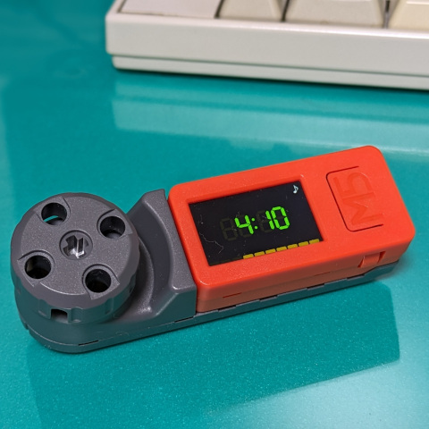

# M5StickC Plus(2) + ロータリーエンコーダHAT用タイマーアプリケーション

## 概要

M5StickC Plus もしくは M5StickC Plus2とロータリーエンコーダHATを組み合わせて、アラームタイマーとして使用するアプリケーションです。

## 操作

<dl>
  <dt>ロータリーノブ</dt>
  <dd>タイムアウト時間の変更。ノブの押し込みで変更対象の桁の移動。<dd>

  <dt>ボタンA</dt>
  <dd>クリックでカウントダウンの開始・停止。停止中に長押しした場合はタイムアウト時間のリセット。<dd>

  <dt>ボタンB</dt>
  <dd>クリックで音声モードの変更。モード1(白音符)→モード2(青音符)→モード3(音符禁止)で切り替わる。モード2は時間経過時のクリック音の再生を停止。モード3は一切の音声再生を行わない。<dd>

  <dt>電源ボタン</dt>
  <dd>電源のON/OFF切り替え。<dd>
</dl>

## その他・バグなど

- M5StickCでも一応動作しますが、ブザーがないのであまり使えません。なお、手持ちのM5StickCはバッテリーが死んでる個体しかなかったので、バッテリーゲージが正しく動作するかどうか確認していません
- ロータリーエンコーダHATなしでも動作しますが、この場合タイムアウト時間の変更ができませんので3分固定のタイマーになります。
- M5StickC Plus2ではなぜか電源が入りにくいです(電源ボタンまわりの仕様変更？)。
- 音符マークのビットマップは[東雲フォント](http://openlab.ring.gr.jp/efont/shinonome/)の16ドットゴシック体のグリフを使用させていただきました。
